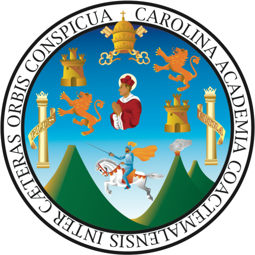

# parcial2
<h5>UNIVERSIDAD DE SAN CARLOS DE GUATEMALA 
ESCUELA DE FORMACION DE PROFESORES DE ENSEÑANZA MEDIA 
DIDACTICA DE LA COMPUTACION 
Lic: MAINOR ESCOBAR. 
Nombre: ELVERT FRANCISCO ORELLANA SAMAYOA</h5>
 
 
<table>
<th></th>
<th></th>
</table>
 
 

<h4> Evaluación segundo parcial </h4>
